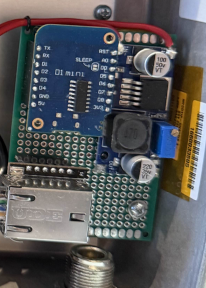
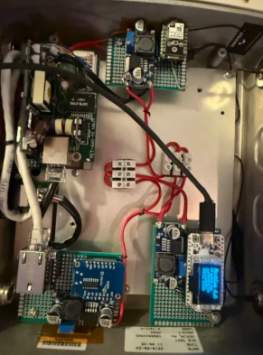
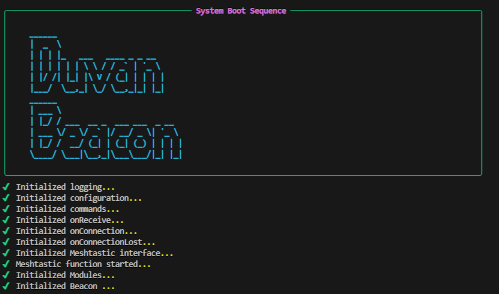

# "The Dove"
## What Started It
As with many things in the Meshtastic community, this project began with the excitement of **creating something useful**, the opportunity to **serve the community**, and the possibility of **collaborating with fellow enthusiasts**.

The jkpg-mesh community consists of members who are actively working to expand the Meshtastic network, but also to show others that Meshtastic puts the power to create **hi-tech communication projects** into their hands — with **low entry constraints**.

People wanting to participate don’t need any special radio licensing. They can buy **completely built units** or modules, which are relatively **inexpensive**, and gradually add components over time. Along the way, they learn about **radio communication**, **antennas**, **software integration**, **electronics design**, **enclosure design**, and much more.

> “The Dove” was created with the hope of being a **beacon for the city of Jönköping** — a starting point for users who want to connect and interact on the *Mesh*.

## Hardware
At first glance, “The Dove” might appear to be a single box. But once you open the lid, you find a **closely choreographed dance** between several technologies and hardware components.

The main pieces are:
- Heltec V3 board  
- Seeed Studio Micro Node  
- Raspberry Pi Zero  
- POE (Power Over Ethernet) unit  
- In-house developed MQTT broker  
- Multiple power supplies  
- INA219 module  
- BME module  
- Procom vertical antenna for 433 MHz  
- Fiberglass antenna (10 dBm) for 868 MHz  
- Weatherproof housing

## Design
The box relies on power supplied via the Ethernet cable (POE). This power is then distributed to **buck converters** (DC-to-DC step-down converters that reduce the input voltage to the desired output).  
This ensures that if something fails on one module, it won’t bring down the entire system, and it also minimizes electrical interference between devices.



The 868 MHz band is served by the Meshtastic unit (Seeed Studio Micro Node), acting as:
1. A potential repeating node in the mesh (set up as CLIENT, following Meshtastic rebroadcast algorithms).  
2. A communication test beacon.

The 433 MHz band is handled by the MeshCom unit (Heltec V3), focusing on:
1. Supporting amateur radio users interested in MeshCom (nodes identify using callsigns, with strong integration to amateur radio networks).  
2. APRS (Automatic Packet Reporting System).

With the integrated MQTT broker, the box can **rebroadcast unit information** (when connected to the internet via Ethernet) and allow users to view selected data through a website.

Additional sensor hardware provides environmental information such as **temperature** and **air pressure**, currently integrated with the 868 MHz Meshtastic unit.

The Raspberry Pi adds an extra layer of control — in the future, it may allow **flashing the units remotely**, or **powering modules on and off** as needed.

Of course, all this functionality means little if nobody can hear it or communicate with it. That’s why the design includes:
1. A Procom vertical antenna for 433 MHz.  
2. A fiberglass antenna (10 dBm) for 868 MHz.

Everything is neatly packaged inside a **repurposed, weatherproof metal box**.



## Code
To give the unit a bit more *intelligence*, a Python application runs on the Raspberry Pi Zero, connected to the 868 MHz Meshtastic unit. It uses the [meshtastic package](https://python.meshtastic.org/):

```bash
pip3 install meshtastic
```
Initially, “The Dove” will only respond to a defined set of commands, but thanks to the integrated hardware, its functionality can (and will) expand over time.



The application establishes a serial interface with the connected Meshtastic unit and monitors incoming messages.

```
interface = meshtastic.serial_interface.SerialInterface()
logging.info("Meshtastic interface attempting onnection...")

def onReceive(packet, interface):
    """
    Handle incoming packets from the Meshtastic device.
    :param packet: The received packet.
    :param interface: The Meshtastic interface instance.
    """
    try:
        match packet['decoded']['portnum']:
            case "TEXT_MESSAGE_APP":
                fromId = packet['fromId']
                body = packet['decoded']['text']
                logging.debug(f"Text package message: {body}")
                msg = command_handler(packet)
            case _:
                #Handle other portnums if needed
                pass
    except Exception as e:
        logging.warning(f"Error parsing packet: {e}")
```
 When a recognized command is received, it prepares a response message and instructs the unit to send it back to the requesting user.

## Where Next?

Currently, Duvan is in the final integration and testing stage (yes, even we tinkerers don’t just build and mount things on a pole without testing!).

We hope this project will inspire others to build their own nodes. If you’d like to sponsor equipment or installation opportunities, please reach out via [jkpg-mesh.se](https://jkpg-mesh.se/)
 or email [jkpg-mesh@protonmail.com](jkpg-mesh@protonmail.com).

A special thanks to Gabriel (SA7GAM) for the hard work, and Martin (SM7UVT) for components and the enclosure.